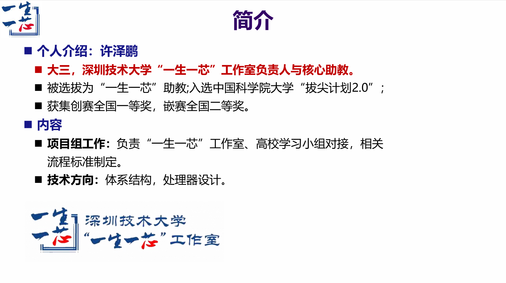

<!-- ########################################## 分割 ########################################## -->

## Hi there 
 
 
 📫 Contacts:202301202097@stumail.sztu.edu.cn
 
 <!-- ########################################## 分割 ########################################## -->

  
  <!-- just img 图片 -->
  
  

  
  
  

  
  <!-- Snake Code Contribution Map 贪吃蛇代码贡献图 -->
<picture>
<source media="(prefers-color-scheme: dark)" srcset="https://github.com/oooingXu/oooingXu/blob/output/github-snake-dark.svg" />
<source media="(prefers-color-scheme: light)" srcset="https://github.com/oooingXu/oooingXu/blob/output/github-snake.svg" />

</picture>
  

- 🌱 I’m currently learning computer architecture and out of order processor.

<!-- ########################################## 分割 ########################################## -->

## ⚡ Skills

<!-- just img 图片 -->

<!--  skill badge 技能徽章 -->

 
 
 

<!-- programming tool icon 编程工具图标 -->

 
 

<!-- svg -->
 

<!-- gif -->

<!-- just img 图片 -->

<!-- profile-3d-contrib 3D 贡献图-->
<picture>
  <source media="(prefers-color-scheme: dark)" srcset="https://cdn.jsdelivr.net/gh/oooingXu/oooingXu/profile-3d-contrib/profile-night-rainbow.svg" />
  <source media="(prefers-color-scheme: light)" srcset="https://cdn.jsdelivr.net/gh/oooingXu/oooingXu/profile-3d-contrib/profile-gitblock.svg" />
  
</picture>

<!-- ########################################## 分割 ########################################## -->

## ⚡ Activity

  

<!-- ########################################## 分割 ########################################## -->

## 📫 More

  
<!-- second form 第二个表格 -->
<table>
  <tr>
    <td></td>
    <td></td>
  </tr>
  <tr>
    <td></td>
    <td></td>
  </tr>
  <tr>
    <td></td>
    <td></td>
  </tr>
  <tr>
    <td></td>
    <td></td>
  </tr>
  <tr>
    <td></td>
    <td></td>
  </tr>
</table>

<!-- ########################################## 分割 ########################################## -->

## 📫 Contacts

  
 Email:202301202097@stumail.sztu.edu.cn

